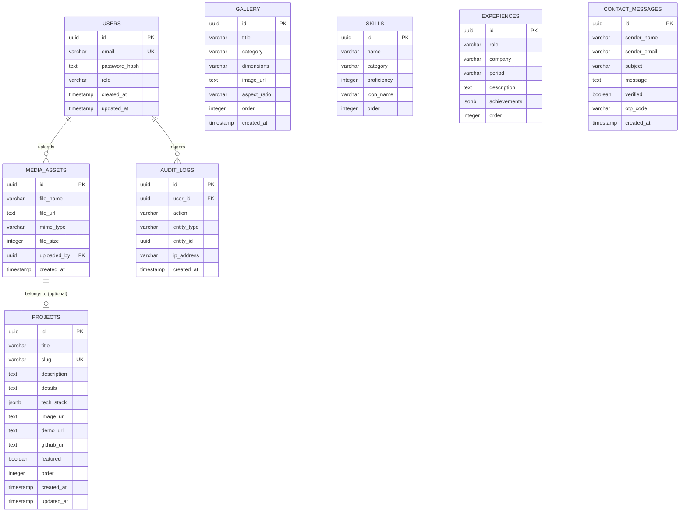

# Entity Relationship Diagram (ERD) & Database Specification

## 1. Visual ERD Diagram (Mermaid)



---

## 2. Entity Dictionary & Cardinalities

| Primary Entity | Foreign Entity | Relationship | Description |
| :--- | :--- | :--- | :--- |
| `USERS` | `MEDIA_ASSETS` | 1-to-Many | Admin user can upload multiple media assets. |
| `USERS` | `AUDIT_LOGS` | 1-to-Many | Admin actions (create project, delete item) logged per user. |
| `PROJECTS` | Independent | Standalone | Master table for portfolio dynamic projects. |
| `GALLERY` | Independent | Standalone | Exhibition art pieces and showcase assets. |
| `SKILLS` | Independent | Standalone | Tech skill matrix with percentage & category. |
| `EXPERIENCES` | Independent | Standalone | Work history timeline entries. |
| `CONTACT_MESSAGES`| Independent | Standalone | OTP verified contact submissions. |

---

## 3. PostgreSQL SQL DDL Schema

```sql
-- Enable UUID extension
CREATE EXTENSION IF NOT EXISTS "uuid-ossp";

-- 1. Users Table
CREATE TABLE users (
    id UUID PRIMARY KEY DEFAULT uuid_generate_v4(),
    email VARCHAR(255) NOT NULL UNIQUE,
    password_hash TEXT NOT NULL,
    role VARCHAR(50) NOT NULL DEFAULT 'admin',
    created_at TIMESTAMP WITH TIME ZONE DEFAULT CURRENT_TIMESTAMP NOT NULL,
    updated_at TIMESTAMP WITH TIME ZONE DEFAULT CURRENT_TIMESTAMP NOT NULL
);

-- 2. Projects Table
CREATE TABLE projects (
    id UUID PRIMARY KEY DEFAULT uuid_generate_v4(),
    title VARCHAR(255) NOT NULL,
    slug VARCHAR(255) NOT NULL UNIQUE,
    description TEXT NOT NULL,
    details TEXT,
    tech_stack JSONB NOT NULL DEFAULT '[]'::jsonb,
    image_url TEXT NOT NULL,
    demo_url TEXT,
    github_url TEXT,
    featured BOOLEAN NOT NULL DEFAULT FALSE,
    display_order INT NOT NULL DEFAULT 0,
    created_at TIMESTAMP WITH TIME ZONE DEFAULT CURRENT_TIMESTAMP NOT NULL,
    updated_at TIMESTAMP WITH TIME ZONE DEFAULT CURRENT_TIMESTAMP NOT NULL
);

-- 3. Gallery Table
CREATE TABLE gallery (
    id UUID PRIMARY KEY DEFAULT uuid_generate_v4(),
    title VARCHAR(255) NOT NULL,
    category VARCHAR(100) NOT NULL,
    dimensions VARCHAR(100),
    image_url TEXT NOT NULL,
    aspect_ratio VARCHAR(20) DEFAULT '16/9',
    display_order INT NOT NULL DEFAULT 0,
    created_at TIMESTAMP WITH TIME ZONE DEFAULT CURRENT_TIMESTAMP NOT NULL
);

-- 4. Skills Table
CREATE TABLE skills (
    id UUID PRIMARY KEY DEFAULT uuid_generate_v4(),
    name VARCHAR(100) NOT NULL,
    category VARCHAR(100) NOT NULL,
    proficiency INT NOT NULL CHECK (proficiency BETWEEN 1 AND 100),
    icon_name VARCHAR(100),
    display_order INT NOT NULL DEFAULT 0
);

-- 5. Experiences Table
CREATE TABLE experiences (
    id UUID PRIMARY KEY DEFAULT uuid_generate_v4(),
    role VARCHAR(255) NOT NULL,
    company VARCHAR(255) NOT NULL,
    period VARCHAR(100) NOT NULL,
    description TEXT NOT NULL,
    achievements JSONB NOT NULL DEFAULT '[]'::jsonb,
    display_order INT NOT NULL DEFAULT 0
);

-- 6. Contact Messages Table
CREATE TABLE contact_messages (
    id UUID PRIMARY KEY DEFAULT uuid_generate_v4(),
    sender_name VARCHAR(255) NOT NULL,
    sender_email VARCHAR(255) NOT NULL,
    subject VARCHAR(255),
    message TEXT NOT NULL,
    verified BOOLEAN NOT NULL DEFAULT FALSE,
    otp_code VARCHAR(10),
    created_at TIMESTAMP WITH TIME ZONE DEFAULT CURRENT_TIMESTAMP NOT NULL
);

-- 7. Media Assets Table
CREATE TABLE media_assets (
    id UUID PRIMARY KEY DEFAULT uuid_generate_v4(),
    file_name VARCHAR(255) NOT NULL,
    file_url TEXT NOT NULL,
    mime_type VARCHAR(100) NOT NULL,
    file_size INT NOT NULL,
    uploaded_by UUID REFERENCES users(id) ON DELETE SET NULL,
    created_at TIMESTAMP WITH TIME ZONE DEFAULT CURRENT_TIMESTAMP NOT NULL
);

-- 8. Audit Logs Table
CREATE TABLE audit_logs (
    id UUID PRIMARY KEY DEFAULT uuid_generate_v4(),
    user_id UUID REFERENCES users(id) ON DELETE CASCADE,
    action VARCHAR(100) NOT NULL,
    entity_type VARCHAR(100) NOT NULL,
    entity_id UUID,
    ip_address VARCHAR(45),
    created_at TIMESTAMP WITH TIME ZONE DEFAULT CURRENT_TIMESTAMP NOT NULL
);

-- Indexes for performance optimization
CREATE INDEX idx_projects_slug ON projects(slug);
CREATE INDEX idx_projects_featured ON projects(featured);
CREATE INDEX idx_skills_category ON skills(category);
CREATE INDEX idx_gallery_category ON gallery(category);
CREATE INDEX idx_audit_user_id ON audit_logs(user_id);
```
