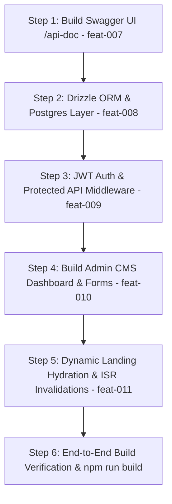

# Phase 3: Implementation Specification & Next Development Roadmap

## 1. Feature Matrix & Development Scope

The following features represent the active scope for Phase 3 development (mapped from `feature_list.json`):

| Feature ID | Feature Name | Tech Stack | Status | Description |
| :--- | :--- | :--- | :--- | :--- |
| **`feat-007`** | Swagger UI Interactive API Docs | `next-swagger-doc`, `swagger-ui-react` | Planned | Interactive OpenAPI 3.0 UI at `/api-doc` with Bearer auth support. |
| **`feat-008`** | PostgreSQL & Drizzle ORM Layer | `drizzle-orm`, `pg` / `neon` | Planned | Database schemas, connection pool, and automated data seeder. |
| **`feat-009`** | JWT Auth & Protected APIs | `jose`, `bcryptjs`, Next.js Middleware | Planned | Login route, HTTP-only cookie tokens, and middleware route guards. |
| **`feat-010`** | Admin CMS Dashboard | `shadcn/ui`, React Hook Form, Zod | Planned | Admin CRUD dashboard at `/admin/dashboard` with media uploader. |
| **`feat-011`** | Dynamic Hydration & ISR Caching | Next.js Server Components, `revalidateTag` | Planned | Hydrate public landing page from DB with cache tag invalidation. |

---

## 2. Core Functions & Technical Utility Modules

### A. Authentication Module (`lib/auth.ts`)
* `hashPassword(password: string): Promise<string>`
  * *Function*: Hashes admin password using `bcryptjs` with 12 salt rounds.
* `comparePassword(password: string, hash: string): Promise<boolean>`
  * *Function*: Verifies input password against stored hash during login.
* `signJWTToken(payload: AdminJWTPayload): Promise<string>`
  * *Function*: Generates signed JWT token using `jose` with 24-hour expiration.
* `verifyJWTToken(token: string): Promise<AdminJWTPayload | null>`
  * *Function*: Validates incoming JWT signature on protected API calls.

### B. Database & ORM Module (`db/schema.ts`, `db/index.ts`)
* `getDbClient()`
  * *Function*: Returns singleton PostgreSQL Drizzle client connection.
* `seedDatabase()`
  * *Function*: Auto-populates PostgreSQL tables with initial data from `data/portfolioData.ts` if tables are empty.

### C. OpenAPI / Swagger Generator (`lib/swagger.ts`)
* `getApiDocs(): Promise<object>`
  * *Function*: Dynamically scans `/app/api` route handlers and builds OpenAPI 3.0 JSON specification.

### D. Middleware & Route Security (`middleware.ts`)
* `middleware(req: NextRequest)`
  * *Function*: Intercepts requests to `/admin/*` and protected `POST`/`PUT`/`DELETE` API routes, checks HTTP-only cookie for valid JWT, and redirects to `/admin/login` if unauthenticated.

---

## 3. New UI Components & Pages to Build

```
app/
├── api-doc/
│   └── page.tsx                # Client wrapper rendering <SwaggerUI spec={spec} />
├── admin/
│   ├── login/
│   │   └── page.tsx            # Admin Login Page (Form + JWT submission)
│   └── dashboard/
│       ├── layout.tsx          # Admin Sidebar & Header Navigation Shell
│       ├── page.tsx            # Overview Metrics (Total Projects, Messages, Gallery Items)
│       ├── projects/
│       │   └── page.tsx        # Project Manager (DataTable + Modal Form)
│       ├── gallery/
│       │   └── page.tsx        # Gallery Manager (Grid + Image Upload)
│       └── skills/
│           └── page.tsx        # Skills Matrix Manager (Category reordering + slider)
```

### Component Breakdown
* `<SwaggerViewer />` (`components/SwaggerViewer.tsx`): Interactive Swagger interface rendered with custom dark mode styling.
* `<AdminSidebar />` (`components/admin/AdminSidebar.tsx`): Navigation sidebar for CMS dashboard tabs.
* `<ProjectFormModal />` (`components/admin/ProjectFormModal.tsx`): React Hook Form + Zod form for creating/editing projects.
* `<MediaUploader />` (`components/admin/MediaUploader.tsx`): Drag-and-drop image dropzone with live preview and upload progress indicator.

---

## 4. API Endpoints & Request/Response Contracts

### 1. `POST /api/auth/login`
* **Request Body**:
  ```json
  {
    "email": "admin@chievo.com",
    "password": "SecureAdminPassword123!"
  }
  ```
* **Response (200 OK)**:
  ```json
  {
    "success": true,
    "user": { "email": "admin@chievo.com", "role": "admin" }
  }
  ```
  *(Sets `Set-Cookie: jwt_token=...; HttpOnly; Secure; SameSite=Strict`)*

### 2. `GET /api/projects`
* **Response (200 OK)**:
  ```json
  {
    "data": [
      {
        "id": "c1a2b3-...",
        "title": "Industrial VR Simulator",
        "slug": "industrial-vr-simulator",
        "description": "Unity 3D VR simulation software...",
        "techStack": ["Unity 3D", "C#", "SteamVR"],
        "imageUrl": "/images/project1.png",
        "featured": true,
        "order": 1
      }
    ]
  }
  ```

### 3. `POST /api/projects` *(Protected)*
* **Headers**: `Authorization: Bearer <token>` or Cookie.
* **Request Body**:
  ```json
  {
    "title": "New VR Project",
    "slug": "new-vr-project",
    "description": "High fidelity simulation",
    "techStack": ["Unity", "C#"],
    "imageUrl": "https://res.cloudinary.com/demo/image.png",
    "demoUrl": "https://demo.example.com",
    "githubUrl": "https://github.com/example/repo",
    "featured": true
  }
  ```
* **Response (201 Created)**: Returns created project entity.

---

## 5. Step-by-Step Execution Sequence


