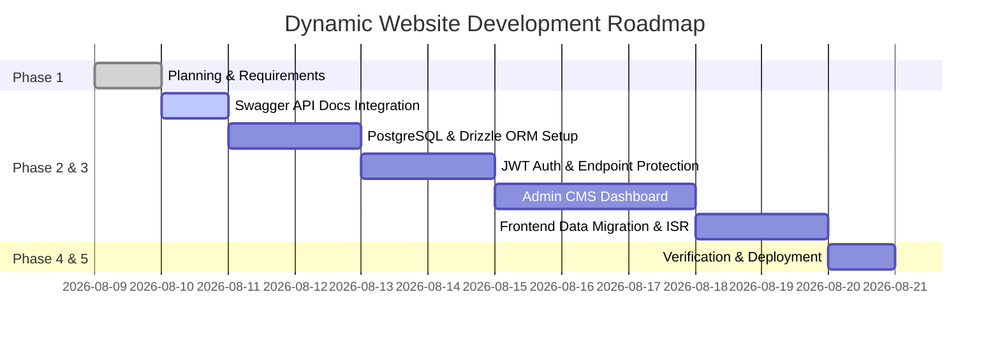

# Phase 1: Planning & Requirement Analysis

## 1. Project Overview & Business Goals
* **Project Name**: Chievo Dynamic Portfolio & Admin CMS
* **Primary Objective**: Transform static portfolio into a fully dynamic, database-backed web application with a secure content management system (CMS) and interactive Swagger API documentation.
* **Target Audience**: Clients, recruiters, technical managers, and system administrators.

---

## 2. Functional Requirements (FR)

### FR-1: Dynamic Content Management (Admin CMS)
* **CRUD Operations**: Admin user must be able to Create, Read, Update, and Delete:
  * Portfolio Projects (Title, Description, Tags, Tech Stack, Image URLs, Demo/Repo URLs, Featured order).
  * Exhibition Gallery Items (Title, Category, Dimensions, Image URL, Aspect Ratio).
  * Skill Badges & Ability Matrix (Category, Skill Name, Proficiency Level, Icon).
  * Experience Timeline (Role, Company, Period, Description, Key Achievements).
* **Media Management**: Support image file uploads with cloud storage integration (Cloudinary / S3 / Supabase Storage).

### FR-2: Public Landing Page & Dynamic Rendering
* **Dynamic Content Hydration**: Landing page components (`Projects`, `Gallery`, `Skills`, `Experience`) fetch live data from PostgreSQL database via Server Components or API routes.
* **Incremental Static Regeneration (ISR)**: Cache rendered pages and invalidate cache tags (`revalidateTag`) whenever admin makes CMS edits.
* **Interactive Pagination & Filtering**: Category tabs for skills/projects with kinetic animation and view limits.
* **OTP Contact Flow**: Public users send contact messages verified via OTP email delivery (`/api/contact`).

### FR-3: Authentication & Security
* **Admin Auth**: Secure login form at `/admin/login` using JWT (JSON Web Tokens) Bearer token authentication stored in HTTP-only cookies.
* **Protected Routes & APIs**: Middleware guarding `/admin/*` pages and write/delete API endpoints (`POST`, `PUT`, `DELETE`).
* **Rate Limiting & Sanitation**: Input validation via Zod schemas and API rate limiting on public endpoints.

### FR-4: Interactive API Documentation
* **Swagger UI Integration**: Expose OpenAPI 3.0 interactive documentation at `/api-doc`.
* **Authorize Support**: Include JWT Bearer scheme input in Swagger UI for testing protected routes directly from browser.

---

## 3. Non-Functional Requirements (NFR)

| Category | Requirement | Target Metric |
| :--- | :--- | :--- |
| **Performance** | Core Web Vitals & Load Speed | LCP < 1.2s, FID < 100ms, CLS < 0.05 |
| **Type Safety** | Strict TypeScript across stack | 0 `any` types, 0 compilation warnings |
| **Build Integrity** | Clean build pipeline | `npm run build` succeeds with zero errors |
| **Security** | Auth tokens & Password Security | Passwords hashed using `bcrypt` (12 rounds) |
| **SEO** | Metadata & Open Graph | Dynamic `sitemap.xml`, OG tags per project |
| **Responsiveness** | Mobile-first breakpoint design | Seamless UI from 320px mobile to 4K displays |

---

## 4. Technical Architecture & Tech Stack

```
[ Public User / Client ]          [ Admin User ]
           │                            │
           ├───────────────┬────────────┘
           ▼               ▼
   ┌──────────────────────────────────────────────┐
   │ Next.js 15 App Router (Frontend + API Routes) │
   └──────────────────────┬───────────────────────┘
                          │
            ┌─────────────┴─────────────┐
            ▼                           ▼
   ┌──────────────────┐       ┌────────────────────┐
   │  PostgreSQL DB   │       │  Cloud Media Storage│
   │  (via Drizzle)   │       │ (Cloudinary / S3)  │
   └──────────────────┘       └────────────────────┘
```

* **Framework**: Next.js 15 (App Router, Server Actions)
* **Language**: TypeScript 5.x (Strict mode)
* **Styling**: Tailwind CSS + `shadcn/ui` + Framer Motion
* **Database & ORM**: PostgreSQL + Drizzle ORM
* **Auth**: Custom JWT / AuthJS / NextAuth
* **API Docs**: `next-swagger-doc` + `swagger-ui-react`

---

## 5. Data Entity Model (ERD Draft)

1. **Users (Admin)**
   * `id` (UUID, PK), `email` (Unique), `passwordHash` (Text), `createdAt` (Timestamp)
2. **Projects**
   * `id` (UUID, PK), `title` (Text), `slug` (Unique Text), `description` (Text), `techStack` (JSON Array), `imageUrl` (Text), `demoUrl` (Text), `githubUrl` (Text), `featured` (Boolean), `order` (Integer)
3. **Gallery**
   * `id` (UUID, PK), `title` (Text), `category` (Text), `dimensions` (Text), `imageUrl` (Text), `order` (Integer)
4. **Skills**
   * `id` (UUID, PK), `name` (Text), `category` (Text), `proficiency` (Integer), `iconName` (Text), `order` (Integer)
5. **Contact Messages**
   * `id` (UUID, PK), `senderName` (Text), `senderEmail` (Text), `message` (Text), `otpCode` (Text), `verified` (Boolean), `createdAt` (Timestamp)

---

## 6. Implementation Milestones


