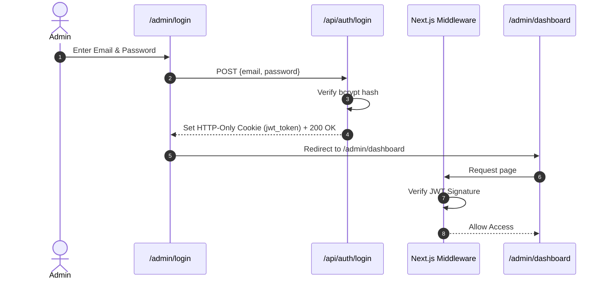

# Phase 2: System Design & Architecture

## 1. System Architecture & Component Communication

```mermaid
graph TD
    Client[Browser / Client] -->|HTTP GET / Page Load| NextServer[Next.js 15 App Server]
    Admin[Admin User] -->|POST /api/auth/login| NextServer
    NextServer -->|Verify JWT Middleware| AdminAPI[Protected API Routes /admin/*]
    
    NextServer -->|Drizzle ORM Queries| PostgresDB[(PostgreSQL Database)]
    AdminAPI -->|Mutations / CRUD| PostgresDB
    AdminAPI -->|Upload Media| CloudStorage[Cloudinary / Storage Service]
    
    SwaggerUI[Swagger UI /api-doc] -->|Fetch OpenAPI Spec| NextServer
    PublicVisitor[Public Visitor] -->|POST /api/contact| ContactRoute[/api/contact Route]
    ContactRoute -->|Nodemailer OTP| EmailServer[SMTP Email Server]
```

---

## 2. Database Schema Design (Drizzle ORM / PostgreSQL)

### Tables Specification

#### 1. `users` (Admin Accounts)
```typescript
export const users = pgTable('users', {
  id: uuid('id').defaultRandom().primaryKey(),
  email: varchar('email', { length: 255 }).notNull().unique(),
  passwordHash: text('password_hash').notNull(),
  role: varchar('role', { length: 50 }).default('admin').notNull(),
  createdAt: timestamp('created_at').defaultNow().notNull(),
  updatedAt: timestamp('updated_at').defaultNow().notNull(),
});
```

#### 2. `projects` (Portfolio Projects)
```typescript
export const projects = pgTable('projects', {
  id: uuid('id').defaultRandom().primaryKey(),
  title: varchar('title', { length: 255 }).notNull(),
  slug: varchar('slug', { length: 255 }).notNull().unique(),
  description: text('description').notNull(),
  details: text('details'),
  techStack: jsonb('tech_stack').$type<string[]>().notNull(),
  imageUrl: text('image_url').notNull(),
  demoUrl: text('demo_url'),
  githubUrl: text('github_url'),
  featured: boolean('featured').default(false).notNull(),
  order: integer('order').default(0).notNull(),
  createdAt: timestamp('created_at').defaultNow().notNull(),
});
```

#### 3. `gallery` (Exhibition Items)
```typescript
export const gallery = pgTable('gallery', {
  id: uuid('id').defaultRandom().primaryKey(),
  title: varchar('title', { length: 255 }).notNull(),
  category: varchar('category', { length: 100 }).notNull(),
  dimensions: varchar('dimensions', { length: 100 }),
  imageUrl: text('image_url').notNull(),
  aspectRatio: varchar('aspect_ratio', { length: 20 }).default('16/9'),
  order: integer('order').default(0).notNull(),
  createdAt: timestamp('created_at').defaultNow().notNull(),
});
```

#### 4. `skills` (Technical Skills Matrix)
```typescript
export const skills = pgTable('skills', {
  id: uuid('id').defaultRandom().primaryKey(),
  name: varchar('name', { length: 100 }).notNull(),
  category: varchar('category', { length: 100 }).notNull(), // 'Frontend', 'Backend', 'DevOps', etc.
  proficiency: integer('proficiency').notNull(), // 1 - 100
  iconName: varchar('icon_name', { length: 100 }),
  order: integer('order').default(0).notNull(),
});
```

#### 5. `contact_messages` (Form Submissions)
```typescript
export const contactMessages = pgTable('contact_messages', {
  id: uuid('id').defaultRandom().primaryKey(),
  senderName: varchar('sender_name', { length: 255 }).notNull(),
  senderEmail: varchar('sender_email', { length: 255 }).notNull(),
  message: text('message').notNull(),
  verified: boolean('verified').default(false).notNull(),
  createdAt: timestamp('created_at').defaultNow().notNull(),
});
```

---

## 3. API Contract & Endpoint Specification

| Endpoint | Method | Auth | Description |
| :--- | :--- | :--- | :--- |
| `/api/auth/login` | `POST` | Public | Authenticate admin & return JWT HTTP-only cookie |
| `/api/auth/me` | `GET` | Bearer | Get active admin session info |
| `/api/projects` | `GET` | Public | Fetch dynamic list of portfolio projects |
| `/api/projects` | `POST` | Bearer | Create new project entity |
| `/api/projects/[id]` | `PUT/DELETE` | Bearer | Update or delete existing project |
| `/api/gallery` | `GET` | Public | Fetch exhibition gallery items |
| `/api/gallery` | `POST/DELETE`| Bearer | Manage gallery content |
| `/api/skills` | `GET` | Public | Fetch skills matrix |
| `/api/contact` | `POST` | Public | Send OTP email verification & store message |
| `/api-doc` | `GET` | Public | Render interactive Swagger UI documentation |

---

## 4. Auth & Security Design



* **Token Payload**: `{ sub: userId, email: userEmail, role: "admin", exp: 86400 }`
* **Algorithm**: `HS256` signed with `JWT_SECRET` environment variable.
* **Storage**: HTTP-Only, SameSite=Strict, Secure cookie.

---

## 5. UI Architecture & Directory Structure Expansion

```
app/
├── (public)/
│   ├── layout.tsx
│   └── page.tsx                # Landing page (hydrated from DB)
├── api/
│   ├── auth/
│   │   ├── login/route.ts      # JWT login handler
│   │   └── me/route.ts         # User profile
│   ├── projects/
│   │   ├── route.ts            # GET/POST projects
│   │   └── [id]/route.ts       # PUT/DELETE project
│   ├── gallery/route.ts        # GET/POST gallery
│   ├── skills/route.ts         # GET/POST skills
│   ├── contact/route.ts        # Existing OTP route
│   └── doc/route.ts            # OpenAPI Spec JSON generator
├── api-doc/
│   └── page.tsx                # Interactive Swagger UI viewer
└── admin/
    ├── login/page.tsx          # Admin login portal
    └── dashboard/
        ├── page.tsx            # CMS Overview
        ├── projects/page.tsx   # Project manager
        ├── gallery/page.tsx    # Gallery manager
        └── skills/page.tsx     # Skills manager
```
