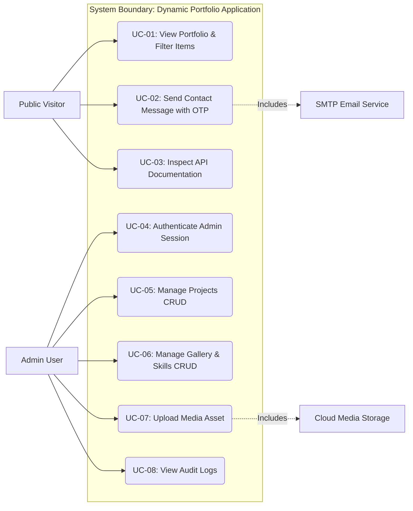

# Use Case Specifications & Actor Interaction Diagrams

## 1. Actor Profiles

| Actor | Type | Description |
| :--- | :--- | :--- |
| **Public Visitor** | Primary (Unauthenticated) | Recruiter, client, or developer exploring portfolio content, skills, gallery, and sending contact messages. |
| **Admin User** | Primary (Authenticated) | System administrator managing portfolio projects, gallery items, skills matrix, and reviewing messages via CMS. |
| **SMTP / Mail Service** | Secondary (System) | Background mailer delivering OTP verification codes to public visitors. |
| **Cloud Storage** | Secondary (System) | Third-party image host storing uploaded project thumbnails and gallery artwork. |

---

## 2. Use Case Diagram (Mermaid)

---

## 3. Detailed Use Case Specifications

### UC-01: View Dynamic Portfolio & Filter Content
* **Primary Actor**: Public Visitor
* **Pre-conditions**: App is online and connected to PostgreSQL DB.
* **Main Flow**:
  1. Visitor lands on home page (`/`).
  2. Next.js fetches dynamic projects, skills, and gallery items from database.
  3. Visitor clicks category tabs (e.g., "Frontend", "Backend") or expands project views.
  4. UI smoothly animates and displays filtered list.
* **Alternative Flow**: If database query fails, static fallback cached content is displayed seamlessly.

---

### UC-02: Send Verified Contact Message (OTP Flow)
* **Primary Actor**: Public Visitor
* **Secondary Actor**: SMTP Email Service
* **Pre-conditions**: Public visitor wants to send a message via `/api/contact`.
* **Main Flow**:
  1. Visitor inputs Name, Email, Subject, and Message in Contact section.
  2. Visitor submits form -> System generates 6-digit OTP and sends email via SMTP.
  3. UI prompts visitor for 6-digit OTP code.
  4. Visitor enters OTP -> System verifies OTP match.
  5. Message marked `verified: true` in database -> Success notification shown to visitor.
* **Exception Flow**: Incorrect OTP entered -> System displays "Invalid Code", allows up to 3 retries.

---

### UC-03: Authenticate Admin Session
* **Primary Actor**: Admin User
* **Pre-conditions**: Admin navigates to `/admin/login`.
* **Main Flow**:
  1. Admin enters email and password.
  2. System compares password against `password_hash` using bcrypt.
  3. System generates JWT signed token, sets HTTP-only cookie, and redirects to `/admin/dashboard`.
* **Exception Flow**: Invalid credentials -> System displays "Invalid email or password" error.

---

### UC-04: Manage Dynamic Projects (CRUD)
* **Primary Actor**: Admin User
* **Pre-conditions**: Admin is authenticated with valid JWT cookie.
* **Main Flow**:
  1. Admin navigates to `/admin/projects`.
  2. Admin fills project form (Title, Slug, Tech Stack, Image URL, Demo Link).
  3. Admin clicks "Save Project" -> System calls `POST /api/projects`.
  4. System validates input with Zod, inserts record into PostgreSQL, and triggers ISR cache revalidation (`revalidateTag('projects')`).
  5. Updated project appears immediately on public landing page.

---

### UC-05: Upload Media Asset
* **Primary Actor**: Admin User
* **Secondary Actor**: Cloud Media Storage
* **Pre-conditions**: Admin creating or editing project/gallery item.
* **Main Flow**:
  1. Admin selects image file in CMS form.
  2. System streams file to Cloud Storage (Cloudinary/S3).
  3. Cloud Storage returns secure HTTPS file URL.
  4. System fills image URL field automatically in CMS form.

---

### UC-06: Inspect Interactive Swagger API Docs
* **Primary Actor**: Public Visitor / Developer
* **Pre-conditions**: User navigates to `/api-doc`.
* **Main Flow**:
  1. User views OpenAPI 3.0 interactive Swagger interface.
  2. User expands endpoints (`/api/projects`, `/api/contact`).
  3. User inputs parameter data and clicks "Try it out" to send live API test requests.
  4. System returns JSON response with HTTP status code.
